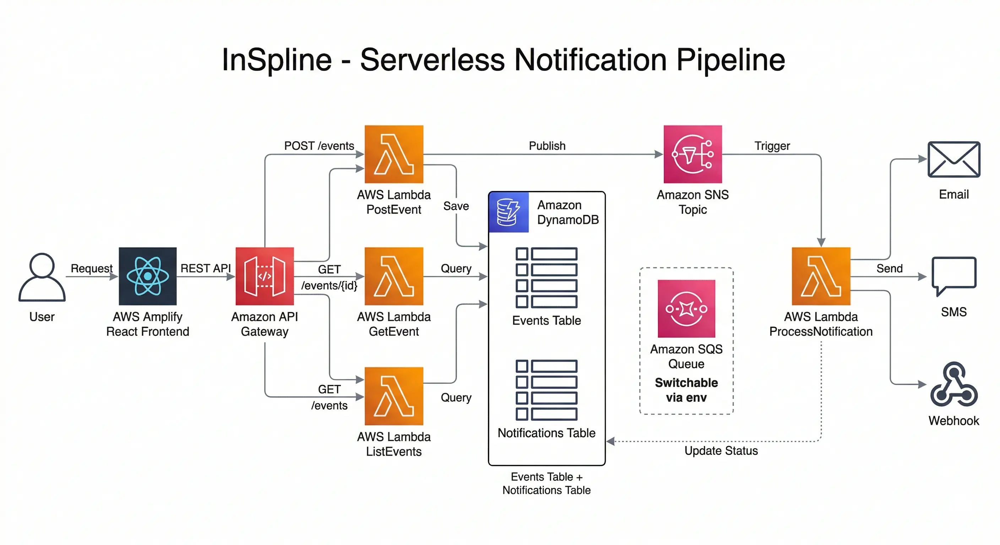

# InSpline 과제 박정진 - 서버리스 이벤트 기반 알림 파이프라인 (BE-1)

> 12-Factor: III. Config / IV. Backing Services / XI. Logs / I. Codebase

InSpline 치과 보험 청구 시스템의 이벤트(예약 확인, 보험 승인, 청구 완료)를 수신하여 이메일/SMS/Webhook으로 알림을 발송하는 서버리스 파이프라인입니다.

## 아키텍처



## 데모

| 항목           | 값                                         |
| -------------- | ------------------------------------------ |
| 프론트엔드 URL | https://main.d9dei3gqird1y.amplifyapp.com/ |
| ID             | inspline                                   |
| PW             | inspline                                   |

## 사전 준비

### 1. Node.js 설치

Node.js 20.x 이상이 필요합니다.

```bash
node --version  # v20.x.x 확인
```

설치: https://nodejs.org/

### 2. IAM 사용자 생성

AWS 콘솔에서 IAM 사용자를 생성합니다.

1. AWS 콘솔 → IAM → 사용자 → 사용자 추가
2. 사용자 이름 입력 (예: `inspline-deploy`)
3. 권한 정책에서 `AdministratorAccess` 연결
4. 사용자 생성 후 **Access Key ID**와 **Secret Access Key**를 저장

> 과제 시연 목적으로 `AdministratorAccess`를 사용했습니다. 실제 프로덕션에서는 Lambda, DynamoDB, SNS, SQS, API Gateway, CloudFormation, S3, IAM 등 필요한 최소 권한만 부여해야 합니다.

### 3. AWS CLI 설치 및 설정

```bash
# macOS
brew install awscli

# 설치 확인
aws --version
```

설치 후 자격 증명을 설정합니다.

```bash
aws configure
```

| 항목                  | 입력값                    |
| --------------------- | ------------------------- |
| AWS Access Key ID     | IAM에서 발급한 Access Key |
| AWS Secret Access Key | IAM에서 발급한 Secret Key |
| Default region name   | `ap-northeast-2`          |
| Default output format | `json`                    |

### 4. SAM CLI 설치

```bash
# macOS
brew install aws-sam-cli

# 설치 확인
sam --version
```

설치 가이드: https://docs.aws.amazon.com/serverless-application-model/latest/developerguide/install-sam-cli.html

## 배포 방법

### 1. 프로젝트 클론

```bash
git clone https://github.com/1wi11/inspline.git
cd inspline
```

### 2. 의존성 설치

```bash
npm install
```

### 3. 빌드

```bash
sam build
```

### 4. 배포

```bash
sam deploy --stack-name inspline --resolve-s3 --capabilities CAPABILITY_IAM --region ap-northeast-2
```

배포가 완료되면 API Gateway 엔드포인트 URL이 출력됩니다.

```
Outputs
-----------------------------------------
Key                 ApiUrl
Description         API Gateway endpoint URL
Value               https://xxxxxxxxxx.execute-api.ap-northeast-2.amazonaws.com/Prod/
-----------------------------------------
```

### 5. 코드 변경 후 재배포

```bash
sam build && sam deploy --stack-name inspline --resolve-s3 --capabilities CAPABILITY_IAM --region ap-northeast-2
```

### 6. 스택 삭제

```bash
sam delete --stack-name inspline --region ap-northeast-2
```

## 환경변수 목록

`template.yaml`의 `Globals.Function.Environment.Variables`에서 관리됩니다.

### 인프라

| 변수명                     | 설명                            | 기본값          |
| -------------------------- | ------------------------------- | --------------- |
| `EVENTS_TABLE_NAME`        | Events DynamoDB 테이블명        | SAM이 자동 주입 |
| `NOTIFICATIONS_TABLE_NAME` | Notifications DynamoDB 테이블명 | SAM이 자동 주입 |

### 메시지 큐 (12F-IV: Backing Services)

| 변수명                   | 설명                            | 기본값          |
| ------------------------ | ------------------------------- | --------------- |
| `MESSAGE_QUEUE_PROVIDER` | 큐 서비스 선택 (`sns` / `sqs`)  | `sns`           |
| `TOPIC_ARN`              | SNS 토픽 ARN (SNS 선택 시 필수) | SAM이 자동 주입 |
| `QUEUE_URL`              | SQS 큐 URL (SQS 선택 시 필수)   | SAM이 자동 주입 |

### 알림 프로바이더 (12F-III: Config)

| 변수명                          | 설명                                 | 기본값                        |
| ------------------------------- | ------------------------------------ | ----------------------------- |
| `NOTIFICATION_EMAIL_PROVIDER`   | 이메일 프로바이더 (`mock` / `mock2`) | `mock`                        |
| `NOTIFICATION_SMS_PROVIDER`     | SMS 프로바이더 (`mock` / `mock2`)    | `mock`                        |
| `NOTIFICATION_WEBHOOK_PROVIDER` | Webhook 프로바이더 (`mock`)          | `mock`                        |
| `WEBHOOK_URL`                   | Webhook 발송 대상 URL                | `https://example.com/webhook` |

> 환경변수 변경 후 `sam build && sam deploy`로 재배포하면 코드 수정 없이 프로바이더를 전환할 수 있습니다.

## API 사용 예시

> `BASE_URL`은 배포 후 출력되는 API Gateway 엔드포인트로 대체하세요.

### POST /events — 이벤트 발행

```bash
curl -X POST ${BASE_URL}/events \
  -H "Content-Type: application/json" \
  -d '{
    "event_type": "appointment_confirmed",
    "clinic_id": "clinic-001",
    "patient_id": "patient-001",
    "channels": ["email", "sms", "webhook"]
  }'
```

응답:

```json
{
  "event_id": "evt-xxxxxxxx-xxxx-xxxx-xxxx-xxxxxxxxxxxx",
  "status": "queued"
}
```

### GET /events/{event_id} — 이벤트 상세 조회

```bash
curl ${BASE_URL}/events/evt-xxxxxxxx-xxxx-xxxx-xxxx-xxxxxxxxxxxx
```

응답:

```json
{
  "event_id": "evt-xxxxxxxx-xxxx-xxxx-xxxx-xxxxxxxxxxxx",
  "event_type": "appointment_confirmed",
  "clinic_id": "clinic-001",
  "patient_id": "patient-001",
  "channels": ["email", "sms", "webhook"],
  "status": "completed",
  "created_at": "2026-04-07T12:00:00.000Z",
  "notifications": [
    {
      "event_id": "evt-xxx",
      "channel": "email",
      "provider": "mock-email",
      "status": "sent",
      "sent_at": "2026-04-07T12:00:01.000Z"
    },
    {
      "event_id": "evt-xxx",
      "channel": "sms",
      "provider": "mock-sms",
      "status": "sent",
      "sent_at": "2026-04-07T12:00:01.000Z"
    },
    {
      "event_id": "evt-xxx",
      "channel": "webhook",
      "provider": "mock-webhook(https://example.com/webhook)",
      "status": "sent",
      "sent_at": "2026-04-07T12:00:01.000Z"
    }
  ]
}
```

### GET /events — 클리닉별 이벤트 목록 조회

```bash
# 전체 조회
curl "${BASE_URL}/events?clinic_id=clinic-001"

# 상태 필터
curl "${BASE_URL}/events?clinic_id=clinic-001&status=completed"
```

응답:

```json
{
  "events": [
    {
      "event_id": "evt-xxxxxxxx",
      "event_type": "appointment_confirmed",
      "clinic_id": "clinic-001",
      "patient_id": "patient-001",
      "channels": ["email", "sms", "webhook"],
      "status": "completed",
      "created_at": "2026-04-07T12:00:00.000Z"
    }
  ]
}
```

## 테스트

```bash
npm test
```

9개 테스트 스위트, 66개 테스트가 실행됩니다.

| 테스트 대상             | 파일                                         |
| ----------------------- | -------------------------------------------- |
| POST /events 핸들러     | `tests/handlers/postEvent.test.ts`           |
| GET /events/{id} 핸들러 | `tests/handlers/getEvent.test.ts`            |
| GET /events 핸들러      | `tests/handlers/listEvents.test.ts`          |
| 알림 소비 핸들러        | `tests/handlers/processNotification.test.ts` |
| 입력 검증               | `tests/validators/eventValidator.test.ts`    |
| DB Repository           | `tests/db/eventRepository.test.ts`           |
| 프로바이더 팩토리       | `tests/providers/providerFactory.test.ts`    |
| 큐 팩토리               | `tests/queue/queueFactory.test.ts`           |
| 환경변수 검증           | `tests/utils/envValidator.test.ts`           |

## 프로젝트 구조

```
inspline/
├── src/
│   ├── handlers/          # Lambda 핸들러
│   │   ├── postEvent.ts           # POST /events - 이벤트 발행
│   │   ├── getEvent.ts            # GET /events/{id} - 상세 조회
│   │   ├── listEvents.ts          # GET /events - 목록 조회
│   │   └── processNotification.ts # SNS 소비 - 알림 처리
│   ├── providers/         # 알림 프로바이더 추상화
│   │   ├── types.ts               # NotificationProvider 인터페이스
│   │   ├── mockEmailProvider.ts   # Mock 이메일
│   │   ├── mockEmailProviderV2.ts # Mock 이메일 V2 (전환 데모용)
│   │   ├── mockSmsProvider.ts     # Mock SMS
│   │   ├── mockSmsProviderV2.ts   # Mock SMS V2 (전환 데모용)
│   │   ├── mockWebhookProvider.ts # Mock Webhook
│   │   └── providerFactory.ts     # 환경변수 기반 프로바이더 팩토리
│   ├── queue/             # 메시지 큐 추상화
│   │   ├── types.ts               # MessageQueue 인터페이스
│   │   ├── snsQueue.ts            # SNS 구현체
│   │   ├── sqsQueue.ts            # SQS 구현체
│   │   ├── queueFactory.ts        # 환경변수 기반 큐 팩토리
│   │   └── messagePublisher.ts    # 큐 발행 함수
│   ├── db/                # 데이터 접근 계층
│   │   ├── client.ts              # DynamoDB 클라이언트
│   │   └── eventRepository.ts     # Events/Notifications CRUD
│   ├── types/
│   │   └── event.ts               # 이벤트/알림 타입 정의
│   ├── validators/
│   │   └── eventValidator.ts      # 요청 입력 검증
│   └── utils/
│       ├── logger.ts              # JSON 구조화 로깅
│       ├── response.ts            # API 응답 헬퍼
│       └── envValidator.ts        # 환경변수 검증
├── tests/                 # 테스트
├── template.yaml          # SAM 인프라 정의
├── package.json
└── tsconfig.json
```

## 기술 선정 이유 및 설계 결정

### Lambda 런타임: Node.js

- 프론트엔드와 동일한 TypeScript를 사용하여 단일 코드베이스 내에서 타입 정의 공유 (12F-I : Codebase)
- Python 대비 런타임 초기화가 가볍고 콜드 스타트가 짧아, 이벤트 기반 서버리스 환경에 더 적합하다고 판단

### ConsistentRead 적용

`processNotification`에서 모든 채널 완료 여부를 조회할 때 `ConsistentRead: true`를 사용하여, 동시에 처리가 끝나는 경우에도 항상 최신 상태를 읽어 이벤트 상태 갱신 누락을 방지

### SNS/SQS 리소스 동시 생성

`template.yaml`에 SNS 토픽과 SQS 큐를 모두 정의하였다. 사용하지 않는 리소스는 비용이 0원이므로 미리 만들어두고, 환경변수(`MESSAGE_QUEUE_PROVIDER`)만 변경하여 전환할 수 있도록 했다. SNS에서 SQS로 전환 시 `template.yaml`의 Lambda 트리거 변경과 재배포가 필요.

### Lambda 실패 대응

현재 SNS → Lambda 호출이 실패하면 AWS가 기본 3회 재시도한다. 추후 개선 시:

- **Dead Letter Queue(DLQ)** 를 추가하여 재시도 후에도 실패한 메시지가 유실되지 않도록 보관
- DLQ에 쌓인 메시지를 확인 후 SNS에 다시 발행하는 재처리 Lambda를 연결하여 자동 복구 파이프라인으로 확장할 수 있다.

### 향후 확장 가능성

- **Clinics 테이블 추가**: 현재는 `clinic_id`를 직접 입력해야 하지만, 별도 Clinics 테이블을 두면 클리닉 목록 조회 API를 제공하여 사용자가 목록에서 선택할 수 있다
- **실제 프로바이더 연동**: `NotificationProvider` 인터페이스를 구현하는 새 클래스(예: `SesEmailProvider`, `TwilioSmsProvider`)를 추가하고 팩토리에 등록하면 코드 변경 없이 환경변수만으로 전환 가능
- **SNS -> SQS Fan-out 패턴**: 채널별 SQS 큐를 두어 독립적인 재처리와 속도 조절이 가능하도록 확장 가능
